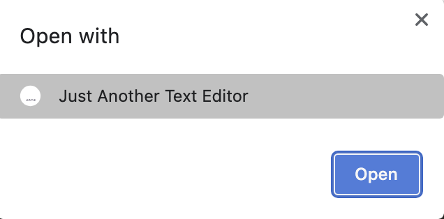
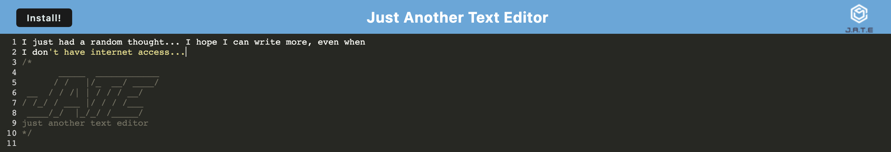
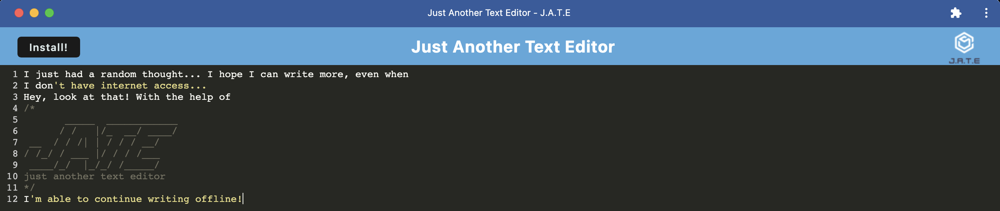

# ***J.A.T.E.: PWA*** <h3>("Just Another Text Editor": Progressive Web App)

 

 

## Overview
When inspiration strikes... you may not be in a place with decent Wi-Fi! That's where J.A.T.E. has you covered! This simple text editor app can run in your browser AND function offline, letting you seamlessly pick-up jotting down thoughts, wherever you are.
 

## Application Set-Up
1) To get started, clone this repo and in your terminal, from the root folder run... 
• `npm i` (to install the "Node Package Module" itself) 
• `npm run build` 
• `npm run start:dev` 

2) Once the dependencies have been installed, use control-C or otherwise terminate operations and close this terminal.

## Application Instructions
1) Visit https://cryptic-everglades-02017-1b72bab49c69.herokuapp.com/ to use the app onine. Add your text.

2) To access the app and the text you've added in offline mode, click the &nbsp;  &nbsp; button to install the app locally, on your device.

3) Upon initial install, the app will open on your device and the text you added will appear. For future offline use, launch the installed app on your device. Or, from https://cryptic-everglades-02017-1b72bab49c69.herokuapp.com/, click the &nbsp;  &nbsp;  icon.

4) Select the app when you see this alert &nbsp;  &nbsp;  and click "Open". Text you added online will appear on the local version of the app and vice versa.

 

## Static Screen-Captures of the Application
<h4>ONLINE</h4>

##

<h4>LOCAL</h4>

 

## Contributors To This Application
Kevin Lewis

 

# ***Thank you for using this App!***

 

## Questions? Contact the Developer on GitHub... 
KPL33
## ...or via Email
kevinsname2003@yahoo.com